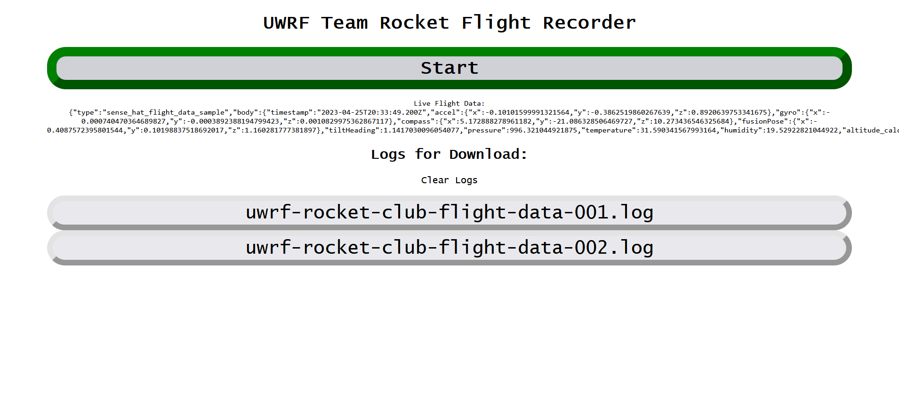

# UWRF Falcon Rocket Team Flight Recorder

## Description:

A rocket flight recorder that runs on a Raspberry Pi with a Sense Hat. It can be used as a template for a Node.js app that does some kind of long processing in the background on a separate thread.

It comes with a web interface that allows a user to start or stop the flight recorder script, download any of the available logs, or delete all logs.

The web interface also notifies the user of the current state of the script on the Pi and attempts to notify the user of any errors it detects.

These directions are intended to permit a user to connect with the Pi over Ethernet to control the flight recorder script. If you are connecting by Wi-Fi, adjust the network setup steps accordingly.



## Usage:
1. Boot the Raspberry Pi
2. Connect control computer/phone to Pi using networking technology of choice
3. On control computer/phone, open a web browser and go to IP address of Pi
4. Once web interface is up, click the "Start" button to start recording flight data

## Setup:
1. Physically install sense hat on Raspberry Pi
2. Install dietpi on Raspberry Pi  
If using another distro, setup instructions may vary from this point on.
You can set some of these settings ahead of time by editing "dietpi.txt" and "dietpi-wifi.txt" on the boot partition of the sd card before first boot.
3. Before first boot, edit "dietpi.txt" to set the Pi to use a static IP address.
4. (optional) Also edit "dietpi-wifi.txt" to preconfigure a wireless network to connect to on first boot.
5. Boot the Pi. You will want to either have a keyboard and monitor plugged into the Pi, or you will need to know its IP address on the wireless network so you can SSH into it. Let DietPi do its first-run scripts before doing anything.
6. Update dietpi using:  
```  
dietpi-update  
apt update
```
7. (optional) Remove unnecessary packages using "dietpi-software"
8. Install dependencies:  
```  
apt install sense-hat build-essential git  
```  
build-essential is needed by the nodejs binding library node-sense-hat, and git is needed by the n nodejs version manager
9. (optional) Install quality-of-life packages:
```
apt install syncthing less mlocate rsync e2fsprogs
```  
These made it easier for me to develop, and/or are nice to have if something goes wrong. To get an up-to-date syncthing, follow the directions at [Up-To-Date Syncthing on Raspberry Pi](https://raspberrypi.stackexchange.com/questions/125081/up-to-date-syncthing-on-raspberry-pi)
10. Enable I2C using:  
"dietpi-config" -> "Advanced Options -> "I2C State" (just press <enter> to toggle from off to on)
11. Install Node.js version 14.21.3 using the "n" nodejs version manager  
```  
curl -L https://git.io/n-install | bash  
n 14.21.3
```
12. Install "flight-recorder" nodejs package locally  
```  
npm install uwrf-team-rocket-flight-recorder
```
13. Copy the included system config files to their locations  
```  
cp dietpi-config-files/uwrf-team-rocket-flight-recorder.service /lib/systemd/system
cp dietpi-config-files/dnsmasq.conf /etc/dnsmasq.conf
```
14. (optional) To reduce the risk of data loss, edit /etc/fstab to add the boot option "sync" to the root partition. I've included a sample fstab in dietpi-config-files/, but yours will probably have different partition UUIDs.
15. Set the Raspberry Pi to serve DHCP addresses on its ethernet port or run as a Wi-Fi hotspot (tutorial)
16. Connect control computer/phone to Raspberry Pi

## Notes:
- I wrote this script under the assumption that I was running as root. If you are not running node as root (usually a good idea), you many have to add "sudo" to the command string for spawning the "sense-hat.js" process. I'm not sure about this, though.
- Although I did not make any design decisions that I knew were overtly insecure, security was not my primary priority on this project. Thus, there is no user authentication and no client input sanitization. I also made no attempt to sanitize IPC messaging or calls, so a compromised "server.js" process running as a normal user may be able to run arbitrary privileged code if it it se to run "sense-hat.js" as root.
- If you end up using this for anything, whether for its intended purpose or as a template, I'd love to know.
- The only image resource that is included in this project is the favicon, and I license that under the same license as the rest of this project.
- Quality-of-life packages explained:
  - syncthing: I wrote this app on the Pi over SSH. I used syncthing to automatically back up the app files from the Pi as I changed them
  - rsync: I tried to use this to back up the app files from the Pi too. I switched to syncthing, but rsync is nice to have anyway
  - less: useful for viewing logs and the output of commands:  
```  
command | less  
```
  - mlocate: finds anything on the Pi (update database using the command updatedb)
  - e2fsprogs: if something goes wrong out in the field, this package of filesystem tools gives you a way to repair the filesystem  
```  
fsck.ext4 /
```
